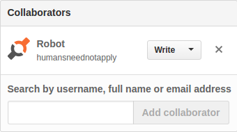

# Install Guide for lychee.js

**QR Codes**


**Quickstart**


This is the it-works-failsafe guide of how to install the lychee.js
Engine on your development machine. For everything related to Bundles,
Dev Ops, Security, Deployments and Virtualization - please consult the
[lychee.js Guide](https://github.com/Artificial-Engineering/lycheejs-guide.git).


**1) Installation**

The Net Installer automatically installs the lychee.js Engine
on any UNIX-compatible machine (arm, x86 or amd64). The only
requirements beforehand are working `bash`, `curl` and `git`.

The lychee.js Engine installation requires at least 2GB of free
memory space at `/opt/lycheejs`. 4GB are recommended to have a
fully working AI knowledge integration.

Depending on your internet connection speed, the installation
will take a couple minutes (needs to download ca. 500MB zip
file of runtime binaries which is hosted in the releases section
of the [lycheejs-runtime](https://github.com/Artificial-Engineering/lycheejs-runtime/releases)
repository).

Notes:

- **Windows** is **unsupported** as development host. Use a VM, the [Docker Image (Arch Linux)](https://hub.docker.com/r/cookiengineer/lycheejs), the [Docker Mini Image (Alpine Linux)](https://hub.docker.com/r/cookiengineer/lycheejs-mini/) or the [Dockerfile](https://github.com/Artificial-Engineering/lycheejs-bundle/blob/master/bin/package/docker/Dockerfile) instead.
- GNU/Linux requires either of `apk`, `apt-get`, `dnf`, `pacman`, `yum` or `zipper` installed beforehand.
- Mac OSX requires [brew](https://brew.sh) installed beforehand.
- FreeBSD/NetBSD requires `pkg` installed and [Linux Compatibility](https://www.freebsd.org/doc/handbook/linuxemu-lbc-install.html) activated beforehand.

```bash
# Install lychee.js Engine into /opt/lycheejs
sudo bash -c "$(curl -fsSL https://lychee.js.org/install.sh)";
```


**2) Bootup**

The `lycheejs-harvester` integrates all projects with the
Software Bots. Start the `development` profile and open
`http://localhost:8080` in your Blink-based Browser.

```bash
cd /opt/lycheejs;

# Bootup lychee.js Harvester
lycheejs-harvester start development;
```


**3) Integration**



The lychee.js Project is tightly integrated with our
Artificial Intelligence, which is represented by the account
[@humansneednotapply](https://github.com/humansneednotapply).

If you want to have our AI to learn and improve from your project
(read the LICENSE section for caveats first), you need to create a
[Personal Access Token](https://github.com/settings/tokens)
with `repo` rights and put the token in the `.github/TOKEN` file:

```bash
cd /opt/lycheejs;

echo "MY-PERSONAL-ACCESS-TOKEN" > .github/TOKEN;
```

Then you must add the account [@humansneednotapply](https://github.com/humansneednotapply)
to your lychee.js Project's repository collaborators in its
`Settings > Collaborators & teams` section.

Notes:

- You need to add @humansneednotapply to each of your lychee.js Projects' repositories.
- You do **not** need to add @humansneednotapply to your lychee.js Fork.

